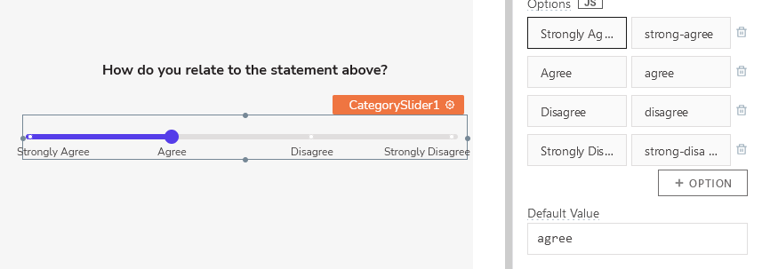
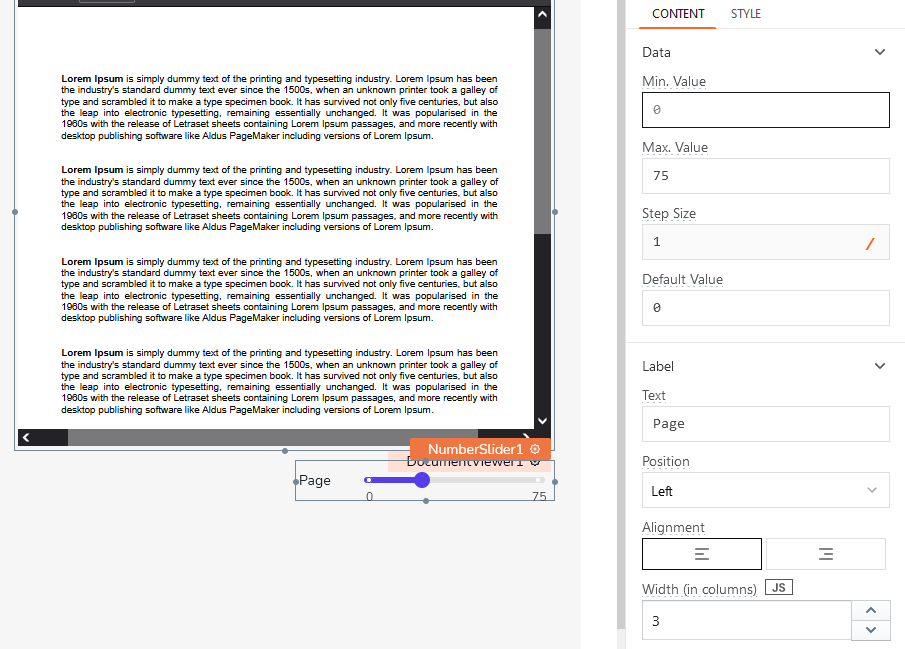
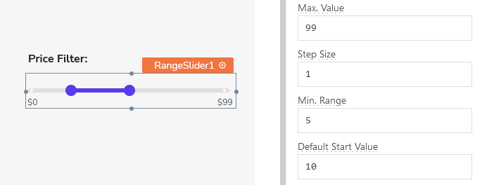

# Sliders
Sliders are useful widgets that allow you to capture user input related to a range of data, and offer visual feedback to users as they select values. Appsmith has three varieties of these widgets: Category, Numerical, and Range sliders.

---
## Add to Canvas
In the left navigation pane, navigate to PAGES —> Select the "Widget" Tab —> Write “Slider". Choose your desired slider variant from the three types that are available.

To add your desired slider widget to your canvas, click and drag it from the widget pane onto the canvas.

Now that you have a slider widget added to the canvas, you can move it anywhere on the canvas by simply dragging it around.

## Usage

### Category Slider
The Category Slider widget can be useful for situations where users must provide feedback along a scale that isn't numerical. Surveys, for example, often have questions which ask respondents to rate how much they agree or disagree with certain statements (that is, Strongly agree/ agree/ disagree/ strongly disagree).

 category_slider.md 

### Number Slider
Use the Number Slider when you want to allow the user to have visual feedback while selecting a numerical value. For example, imagine skimming for pages of a .pdf document, or a series of images in a slideshow. As a user, it can often be helpful to have a visual representation of what part of the media you are viewing.

 number_slider.md 

### Range Slider
Range Sliders are great for allowing users to narrowing and filtering down large sets of data. They're often found in places such as online marketplaces, where an app might offer the ability to search for products based on a certain minimum and maximum price-range.

 range_slider.md 

---

## Events

Each variant of the Slider widget has events that are called when the user adjusts the widget's values:

| **Event** | **Description** | **Example** | **Code Snippet** |
|-----------|-----------------|-------------|------------------|
| **onChange** | Sets an action to take place when the user changes the slider's value. Can be set from the GUI list of common actions (See a list of [supported actions](https://docs.appsmithai.com/reference/appsmith-framework/widget-actions)), or you can define a custom JavaScript function to call instead. | Fetching a certain page or image from a range based upon user selection. |  |
| **onStartValueChange** | (Range Slider) Sets an action to take place when the user changes the range's start value. Can be set from the GUI list of common actions (See a list of [supported actions](https://docs.appsmithai.com/reference/appsmith-framework/widget-actions)), or you can define a custom JavaScript function to call instead. | Filtering a dataset according to user input. |  |
| **onEndValueChange** | (Range Slider) Sets an action to take place when the user changes the range's end value. Can be set from the GUI list of common actions (See a list of [supported actions](https://docs.appsmithai.com/reference/appsmith-framework/widget-actions)), or you can define a custom JavaScript function to call instead. | Filtering a dataset according to user input. |  |

## Styles

Style properties allow you to control the look and feel of your widgets.

| **Style** | **Description** |
|-----------|-----------------|
| **Size** | Sets the size of the widget on the canvas; choose from **S** (Small/4px), **M** (Medium/6px), or **L** (Large/8px). |
| **Color** | Sets the fill color of the slider element. Accepts valid CSS [`color`](https://developer.mozilla.org/en-US/docs/Web/CSS/color) values. |